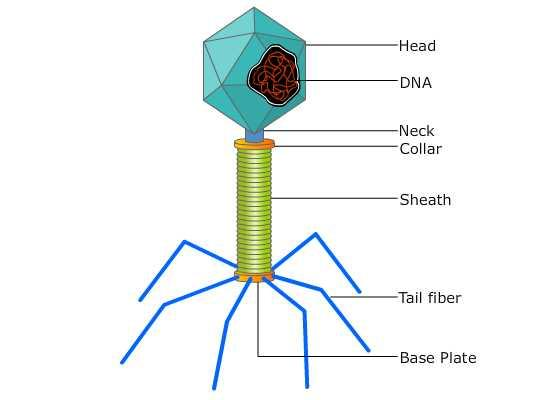
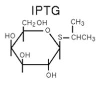

### Principle:

Bacteriophage is a virus which infects bacteria.These  are obligate intracellular parasites that multiply inside bacteria by making use of some or all of the host biosynthetic machinery. Like all viruses, phages are simple organisms that consist of a core of genetic material (nucleic acid)  surrounded by a protein capsid. The nucleic acid may be either DNA or RNA and may be double-stranded or single-stranded. They enter the bacterial cell by landing on the cell wall and injecting their DNA into the bacterial cytoplasm. After entry, the phage DNA acts as a template for production of phage proteins. These proteins replicate the phage and subjugate the cell, eventually causing lysis and death of the host cell.  

IPTG (isopropyl-beta-D-thiogalactopyranoside) is a highly stable synthetic analog of lactose. It inactivates the lac repressor and induces synthesis of beta-galactosidase, an enzyme that promotes lactose utilization. X-Gal (5-bromo-4-chloro-3-indolyl-beta-D-galacto-pyranoside) is an inert chromogenic substrate for beta-galactosidase which hydrolyzes X-Gal into colorless galactose and 4-chloro-3-brom-indigo, forming an intense blue precipitate. Induction of the lacZ gene with IPTG leads to the hydrolysis of X-Gal and to the development of blue colonies.

 

 The number of phage particles contained in the original stock phage culture is determined by counting the number of plaques formed on the seeded agar plate and multiplying this by the dilution factor. For a valid phage count, the number of plaques per plate should not exceed 300 nor be less than 30. Plates showing greater than 300 PFUs are too numerous to count (TNTC); plates showing fewer than 30 PFUs are too few to count (TFTC).
